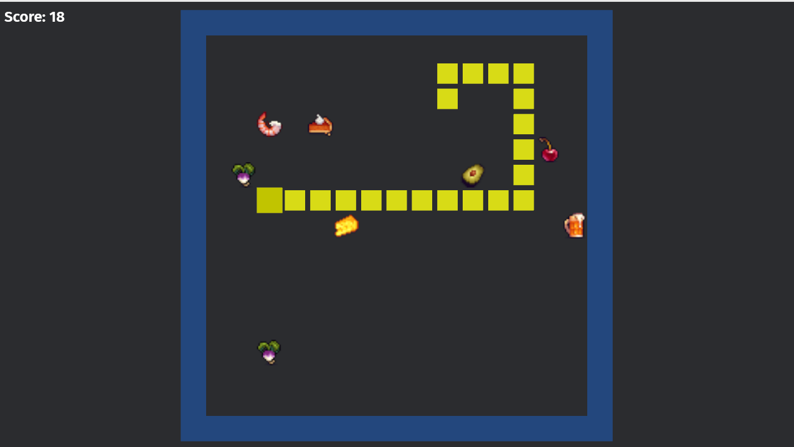

# Snake

The classic Snake game implemented in *Rust* using the Bevy game engine. Use the arrow keys or WASD to change directions and eat as much food as possible. The game ends upon a collision with a border or the tail of the snake.



## Features
- Grid-based snake movement
- Randomly spawning food using sprite images
- Collision detection
- Growing snake segments
- Score and session highscore tracking
- Modular ECS architecture

### Possible future additions
- Multiple difficulty level
- Different game modes
- Animations and effects
- Soundtrack and Audio effects
- Color and theme customization
- Snake skins
- Power-ups

## Setup

### Prerequisites

- Rust toolchain (1.70+) and cargo package manager [Install here](https://www.rust-lang.org/learn/get-started).

- Dependencies for bevy [official Bevy Linux dependencies page](https://github.com/bevyengine/bevy/blob/main/docs/linux_dependencies.md).

### Installation

```bash
git clone https://github.com/marcamsler1/snakegame.git
cd snakegame
```

## Playing the game

```bash
cd snakegame
cargo run
```


## Acknowledgements

The food sprites were downloaded from [here]https://henrysoftware.itch.io/pixel-food and [here](https://ghostpixxells.itch.io/pixel-mart)

## License

See [LICENSE](LICENSE) file for details.
